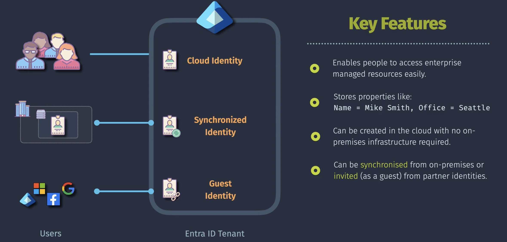
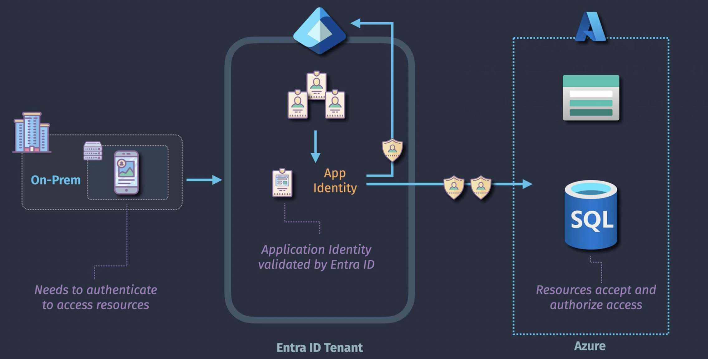
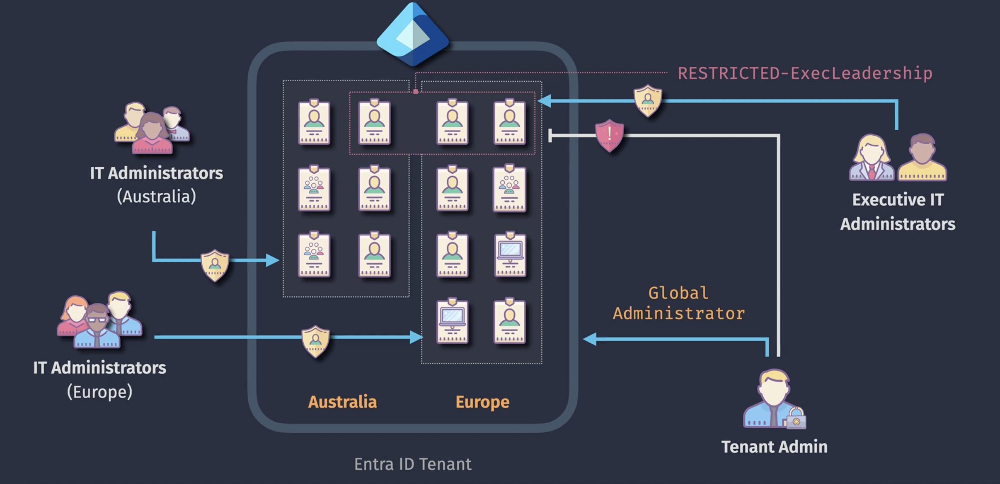
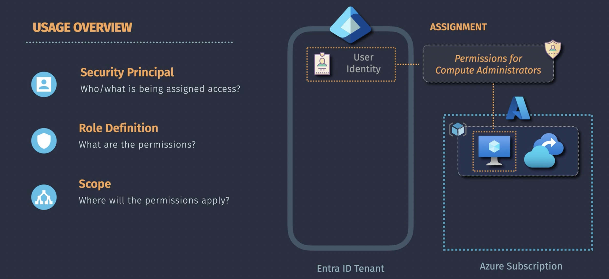
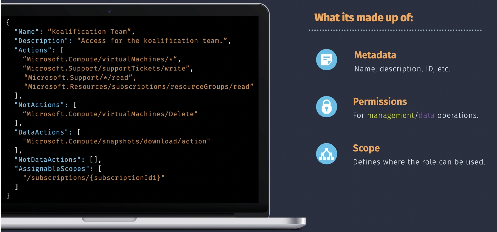

# Microsoft Entra ID

EntraID is not an Azure product. You can use it with many other products outside Azure.

EntraID is a SaaS solution which provides the following services

- Identity Management
- Identity Security and Protection
- Device Management
- Access Management (Resource Access)
- SSO and Federation

Extended features built upon the standard EntraID capabilities

- Privileged Identity Management (Just-in-Time Access, Access Reviews)
- Conditional Access (Conditional Access Policies)
- Identity Protection (sign-in Risk,, User Risk)
- Self Service
  Bases on these features other more advanced features (such as Conditional Access, Privileged Identity Management and Identity Protection) are availabe. Access to these advanced features is dependent on Entra ID license model.

Entra ID is used to manage identities and access to Azure subscriptios, Office365 subscriptions and other SAAS subscriptions  
One Entra ID tenant can be associated with zero or more Azure subscriptions  
One Azure subscription is assocated with one Entra ID tenant only

To access Entra ID you must have an Microsoft account (for example an outlook account such as john.doe@outlook.com)  
In Entra ID you can create tenants  
The primary domain name of an Entra ID tenant ends on `onmicrosoft.com`  
Next to primary domain name a custom domain name of the Entra ID tenant can be created

## Entra ID license models:


## Entra ID is not Active Directory Domain Services (AD DS)

Microsoft Entra ID is the new name for Azure Active Directory.  
Microsoft Entra ID is something other than Active Diretcory Domain Services


## Portals to manage EntraID

- [Azure Portal](https://azure.portal.com)
- [EntraId Portal](https://entra.microsoft.com)
- [ Microsoft Administration Portal](https://admin.microsoft.com)

## Portal to manage user account

- [My Account](https://myaccount.microsoft.com)

## Custom Domain

Every EntraID tenant will have primary domain `onmicrosoft.com`
Next to an Entra ID tenant primary domain name that has been created automatically (`.onmicrosoft.com`) you can create a custom domain name that is for users much easier to remember. When you create a custom domain name you must prove to MS you are the owner of the provided domain name. To prove this you have to add a specific TXT or MX record to the DNS registrar (Azure DNS, GoDaddy, AWS Route53). The custom domain can be configured to be the primary domain of the Entra ID tenant.

## User identities



## Bulk Operations

There are bulk operations to create, invite or delete multiple identities at one. For example, the bulk create operation offers a csv template file you can download, edit (add new identities) and upload.

## Application identities (application registration)



- An application identy helps to control access to the application itself and access of the application has to other resources
- The application itself can reside anywhere, inside or outside Azure
- Each application identity (or client identity) is similar to user identity. A user identity has a username and a password, an application identity has a client ID and client secret or certificate. The application uses these credentials to prove that its identity to the Entra ID tenant. The application has to manage these credentials and store it in a safe place.
- Sometimes the name service principal is used for application identity

## Managed Identity

An application needs to manage the credentials (Client ID and secret or certificate) of the application identity and store it in a secure place. This is difficult. When you are going to run a solution (Azure VM, Azure App Service, Azure Functions) in Azure you do not have to use an application identity. Instead you can create a managed identity and the application does not have to manage the identity credentials any more.

**system-assigned managed identity**: This identity is enabled directly on an Azure resource. When the resource is created the managed identity is automatically created and when the resource is deleted, the managed identity is automatically deleted.

**user-assigned managed identity**: This identity is created as an independent Azure resource and can be assigned to one or more resources. Since it is not tied to a specific resource, it can be shared across different Azure resources and managed separately from the resource lifecycle. Useful when you want to share the same identity across multiple resources for consistent access to Azure services.

## Groups

There a group types:

- Security Groups (for access to Azure resources)
- M365 Groups (for access to Microsoft 365 resource, like Outlook, Sharepoint, Teams and Power BI resources, for collaboration))

Members are manually assigned to **assigned groups**.  
Members are automatically assigned to **dynamic groups** based on user profile attributes.

Group management can be delegated to a group owner.

Members of a group can be:

- Users
- Groups
- Devices
- Enterprise Applications

For each group access can be configured to:

- Azure resources
- Applications
- Licenses

### Dynamic Groups

- Dynamic User Groups
- Dynamic Device Groups
- Dynamic M365 Groups

The purpose of dynamic groups is to automatically add members. Dynamics groups have a rule that specifies when a user/device is added to the group based on the user/device attributes. Azure manages dynamic groups. When for example user1 is member of group IT because of his department attribute and when his department attribute is changed to Finance, then automatically user1 will be member of group Finance and will not be member anymore of group IT. The group owner cannot manually assign members to dynamic groups. The group owner can change the dynamic group attributes, for example the owner can change the group from dynamic to assigned. Then the owner can manually add new member to the group. Note that there might be some delay (max 24 hours but usually within a minute) before members are automatically assigned by the platform to a dynamic group.

For dynamic user and M365 groups (but not dynamic device groups) you need to have the Entra ID Premium P1 license.

Dynamic groups can be for users and devices but not for both.

## Licenses

You can register your licenses in a Entra ID tenant and assign it to users. For microsoft licenses a user must have a location property otherwise the license assignment will fail, because some microsoft license have location restrictions. You can also assign a license to a group

## Administrative Unit

An administrative unit is a group of Entra ID objects (user/devices/groups) that are managed by one or more administrators to which the Entra ID global administrator has delegated some Entra ID permissions. Note the Entra ID global administrator can still manage the Entra ID objects within the administrative unuit.  


## Restricted Administrative Unit

There might Entra ID objects (for example C-suite identities) that must not be managed by the Entra ID tenant global adminsitrator but by a specific group of administrators. These Entra ID object will be grouped in a **RESTRICTED-ExecLeadership** Administrative Unit. Only Executive IT administrators can manage the Entra ID objects in this administrative unit.


You cannot nest administrative units.  
Entra ID Premium P1 license required

## RBAC



Note RBAC **is not** Azure Policy  
RBAC is for permissions  
Azure Policy is for standards

### Security Principal

- User Identity
- Security Group
- App Identity
- Managed Identity

### Role

A role grants permissions. There are 2 type of role definitions:

- built-in roles
- custom roles

Type of management plane built-in roles

- OWNER (full access: resource management and assign permissions)
- CONTRIBUTER (resource management (create, update, delete settings) but cannot assign permissions)
- READER (read-only access)

Type of data plane built-in roles

- DATA (Data roles provide specific permissions related to data plane access (e.g., accessing and managing data within Azure services, like blob storage, databases, or queues)

The roles above are `Job Function Roles` but there are also `Privileged Administrator Roles` which has scope set to all resources in a Subscription

- Owner
- Contributor
- User Access Administrator

### Scope

- Management Group
- Subscription
- Resource Group
- Resource

## Entra ID Role

Entra ID Roles are similar to ordinary Roles only the scope is Entra ID (Tenant, Administrative Unit, App). Entra ID Role grants permission to manage Entra ID objects (such as create user, register device, reset password, ...). You can use Entra ID built-ins roles and Entra ID custom roles. Entra ID custom roles needs to be created first and for that one you need an Entra ID P1 license. Note thsi license is not required for creating ordinary custom roles.

Entra ID roles must have an security principal (user, security group (required Entra ID P1 license), app) and scope. The scope can be:

- Entra ID tenant (directory)
- Administrative Unit
- App

## RBAC Custom Roles

For a RBAC custom role you need to create a role definition (JSON document) and you need to have `Owner` or `User Access Admin` permissions:


The metadata part of a role definition consists of:

- Name: role definition name
- description: role definition description

The permission part of a role definition consists of:

- Actions:list of allowed control plane actions
- NotActions: list of disallowed control plane actions (NotActions have higher precedence than Actions)
- DataActions: list of allowed data plane actions
- NotDataActions: list of disallowed data plane actions (NotDataActions have higher precedence than DataActions)

The scope of a role definition consists can be :

- Root `/*`: available to all scopes. Only usable by built-in roles
- Management Groups `/providers/Microsoft.Management/managementGroups/{ID}`
- Subscriptions `/subscriptions/{ID}`
- Resource Groups `/subscriptions/{ID}/resourcegroups/{name}`

To configure RBAC Custom Roles you need to have `Owner` or `User Access Admin` Role.

Powershell

- Create a new folder: `mkdir roles`
- Navigate to the new folder: `cd roles`
- Create Role definition file `testrole.json`

```
{
  "name": "Test Role",
  "description": "Access for the koalification team.",
  "actions": [
    "Microsoft.Compute/virtualMachines/*",
    "Microsoft.Support/supportTickets/write",
    "Microsoft.Support/*/read",
    "Microsoft.Resources/subscriptions/resourceGroups/read"
  ],
  "notActions": [
    "Microsoft.Compute/virtualMachines/Delete"
  ],
  "dataActions": [
    "Microsoft.Compute/snapshots/download/action"
  ],
  "notDataActions": [],
  "assignableScopes": [
    "/subscriptions/{subscriptionID}"
  ]
}
```

- Create the role: `New-AzRoleDefinition -InputFile ./testrole.json`

Now you can assign the RBAC custom role to an identity (Subscription > Access control(IAM) > Add > Role assignement > Type = custom role)

## Entra ID Custom Roles

Entra ID custom roles are similar to RBAC custom role, except Actions/NotActions/DataActions/NotDataActions are all defined as:

```

microsoft.directory/....

```

Entra ID custom roles requires Entra ID Premium P1 license
To create Entra ID custom roles you need to have `Global admin` or `Privileged Role Admin` permissions

```

```
