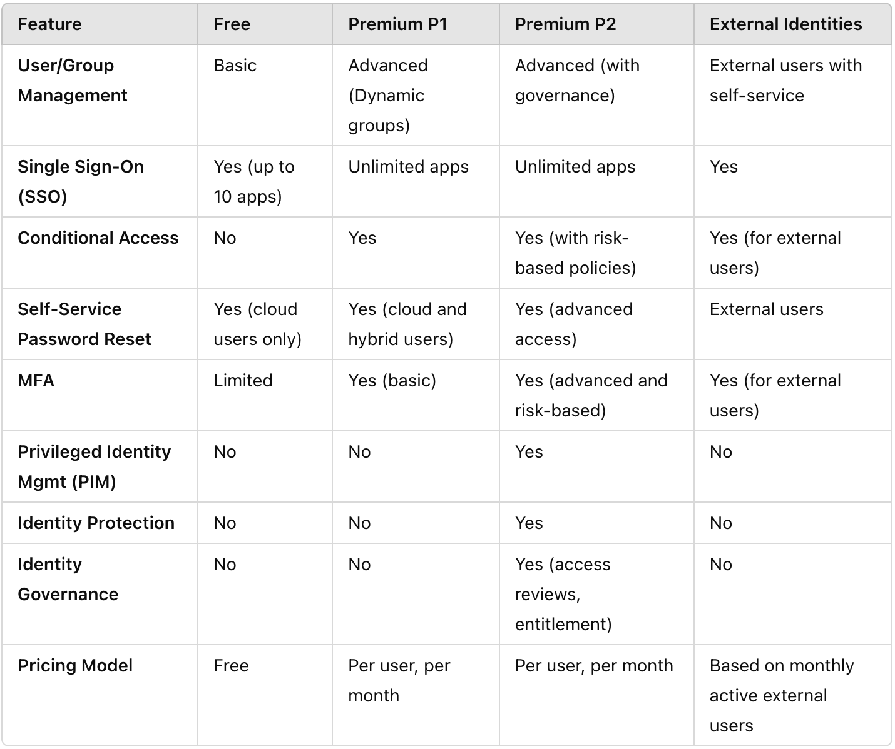
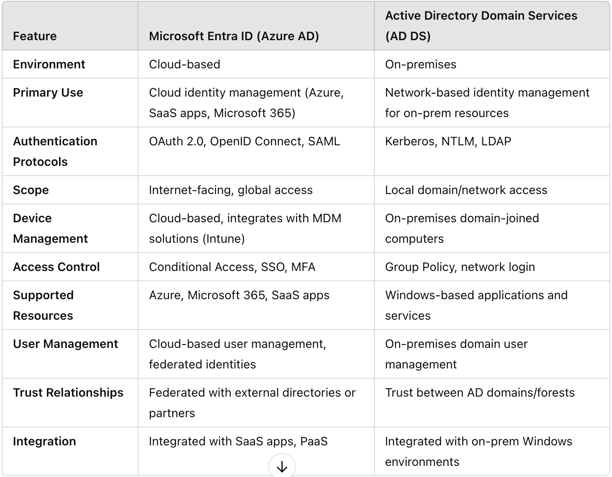
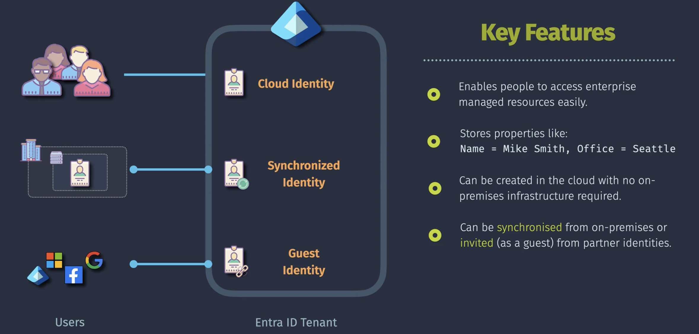

# Microsoft Entra ID

- Identity Management
- Access Management
- SSO
- Federation

Bases on these features other more advanced features (such as Conditional Access, Privileged Identity Management and Identity Protection) are availabe. Access to these advanced features is dependent on Entra ID license model.

Entra ID is used to manage identities and access to Azure subscriptios, Office365 subscriptions and other SAAS subscriptions  
One Entra ID tenant can be associated with zero or more Azure subscriptions  
One Azure subscription is assocated with one Entra ID tenant only

To access Entra ID you must have an Microsoft account (for example an outlook account such as john.doe@outlook.com)  
In Entra ID you can create tenants  
The primary domain name of an Entra ID tenant ends on `onmicrosoft.com`  
Next to primary domain name a custom domain name of the Entra ID tenant can be created

## Entra ID license models:

## Entra ID is not Active Directory Domain Services (AD DS)

Microsoft Entra ID is the new name for Azure Active Directory.  
Microsoft Entra ID is something other than Active Diretcory Domain Services

## Custom Domain

Next to an Entra ID tenant primary domain name that has been created automatically (`.onmicrosoft.com`) you can create a custom domain name that is for users much easier to remember. When you create a custom domain name you must prove to MS you are the owner of the provided domain name. To prove this you have to add a specific TXT or MX record to the DNS registrar (Azure DNS, GoDaddy, AWS Route53). The custom domainn can be configured to be the primary domain of the Entra ID tenant.

## Identities

