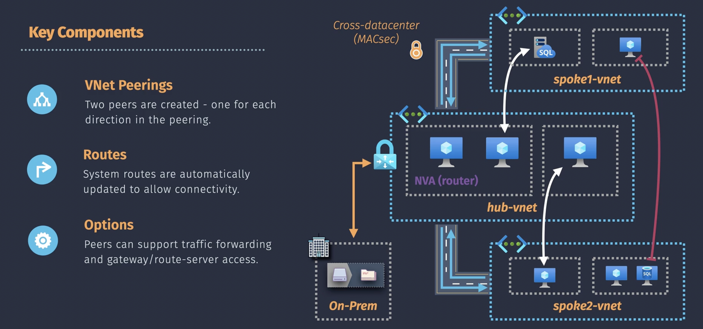
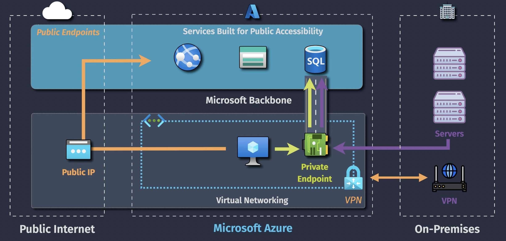

# Networking

## Virtual Network (VNET)

VNET = private, isolated , virtual network in an Azure region
Vnet does not cost any money.

VNET has an IP address space, for example `10.0.0.0/16` (CIRD):

- Network address = `10.0.x.x`
- Number of IP addresses = `65,536`

Note: you can define multiple address spaces for one VNET

A VNET can have one or more Subnets, for example `10.0.1.0/24`:

- Network address = `10.0.1.x`
- Number of IP addresses = `251` + `5` reserved IP addresses (first `4` and last one)

## IP Addressing

- Dynamic IP: IP address changes after stop/deallocation
- Static IP: IP address remains the same, might incur additional cost

Notes:

- `basic` public IP is going to be deprecated in 2025
- Access to `basic` public IP is allowed by default
- Access to `standard` public IP is blocked by default. You need to configure a NSG rule that allows inbound traffic to the public IP

## Outbound connectivity

- When VM does not have public IP, then VM still has outbound connectivity to the internet and Microsoft will provide a public IP
- When VM does have public IP, the VM will use it for outbound connectivity to the internet
- When VM does not have public IP, the traffic can be routed to the internet via the public IP of a load balancer (public load balancer SNAT)
- When VM does not have public IP, the traffic can be routed to the internet via the public IP of a NAT Gateway. When a NAT Gateway is associated with a Subnet in a VNET, then default routes are updated so that outbound traffic of VM's in the subnet are routed via NAT Gateway (so no need to create custom routes)

There is also a set of resources (storage accounts, SQL Server and much more) that already have public IP configured for outbound connectivity

## Network Security Group (NSG)

NGS's are like statefull firewalls that allow or deny traffic. Statefull firewall: when an inbound rule allows traffic no outbound rule is required and vice versa.

Notes:

- Default inbound and outbound rules! You cannot change or remove them
- When a rule is matched no further rules are processed
- `Source` and `Destination` can be:
  - `Any`
  - IP addressed
  - Service tag
  - Application Security Group (ASG)

## Service Tag

Service Tag simplify NSG rules that include traffic for a Microsoft managed service like for example Azure Storage instead of manually using IP addresses

## Application Security Group (ASG)

ASG simplify NSG rules that include traffic for a many VMs serving the same purpose instead of manually using IP addresses

- The NIC of a VM is associated with an ASG
- When you create an ASG you can only associate it with NIC's in the same region
- When an ASG has already been associated with a NIC in a VNET, then the ASG can only be associated with other NICs in the same VNET

## User Defined Routing (UDR)

- Route tables are associated with subnets
- VNETs include default/system routes. You use the route table to overwrite these default/system routes
- Route precedence: Custom > BGP (Border Gateway Protocol used by ExpressRoute) > Deafult

Next hop types:

- Virtual network gateway
- Virtual network
- Internet
- Virtual appliance (include IP of virtual appliance)
- None (drop the traffic)

The address prefix in the route is the priority: use the longest prefix match, an IP address with `/32` is more specific and longer then `/24`

In Azure Portal > Subnets you can watch the effective routes from a selected NIC. It show all the default and user defined routes from the point of view of the selected NIC.

## VNET Peering

VNET Peering provides high bandwidth, low latency connectivity between isolated VNETs

- VNET Peering does not support transitive peering, VM in `spoke2-vnet` cannot connect to VM in `spoke1-vnet` (unless via NVA (Network Virtual Appliance) or router)
- VNET Peering works across regions/subscriptions/tenants
- VNET Peering is not supported for overlapping IP ranges
- You need both peering links to get VNET Peering working

Option in Peering link:

- Allow/block traffic to remote virtual network
- Allow traffic forwarded from remote virtual network / block traffic that originates from outside remote virtual network
- Use this network Virtual Network Gateway or Router Server / Use the remote network Virtual Network Gateway or Router Server / None

## Service Endpoint

Many Azure resource providers are public and are accessed from the internet (PaaS). With Service Endpoints a VM in a VNET can connect to a public resource provider without using its public IP. The traffic is routed over the Microsoft network backbone instead over the internet.

Note that a service endpoint of an public Azure resource provider is not granular. When Subnet1 of VNET1 is connected to the Service Endpoint of the SQL resource provider, then Subnet1 has a network route to all SQL databases.

## Private Link Endpoint

Private Link Endpoint is similar to Service Enpoints in using the Microsoft network backbone to access public resource providers but in addition it has a private endpoint (virtual NIC) in the VNet/Subnet configured with a private IP address

Compared to Service Endpoint:

- Private Link Endpoint has a private IP address
- Private Link Endpoint target a public resource instead of public resource provider (more granular connection)
- Private Link Endpoint can have a DNS name (DNS integration is optional)

Private Link can be used to enable on-premises services access to a public resource provider over VPN and private link (see picture above)

Use the `Private Link Center` in Azure Portal to configure Private Endpoints

## Private Link Service

If you have a partner that has built a solution within Azure and they put a standard Azure load balancer in front then then the partner can provide this solution to customers using Private Link Service. Customers create a Private Link Endpoint to connect to the Private Link Service. The Private Link Service can be provided from another region and subscription.

Private Link Endpoint can connect to an Azure public resources or a Private Link Service  
Use the `Private Link Center` in Azure Portal to configure Private Endpoints and Private Link Services

## Resource Firewalls

Network access to public Azure resource (like storage accouts, SQL, web apps, and many more) can be protected by Resource Firewalls. Resource firewalls only protect **public** endpoints (including Service Endpoints, because Service Endpoints are public IP addresses) of Azure resources.

- Service Endpoints use the public endpoints of public resources and can therefore be protected by Resource Firewalls
- Private Link Endpoints are not protected by Resource Firewalls. If you want to protect Private Endpoints you need to configure `Network Policy for Private Enpoints` at the concerning VNET/Subnet and select if the Private Endpoint is protected by Route Tables (User Defined Routes) and/or NSG.

Resource Firewall configuration options:

- VNET/Subnet (Service Endpoints)
- IP address range
- Allow Azure trusted service access (such as for example Azure Monitoring, Azure Backup)

## VPN Gateway

VNETs are privated, isolated network, but you can attach to a VNET resources like VMs with public IPs. People in on-premises locations can connect to these resources over the internet. But the internet traffic is not protected, meaning hackers can watch along. When you create a VPN tunnel between a VNET and an on-premises network the network traffic is protected and private IPs are used.

### Site-to-Site (S2S) VPN

You can also a S2S VPN between 2 VNETs, although usually you will use VNET Peering to connect 2 VNET's.

When you configure a Virtual Network Gateway you also need to configure in a S2S VPN a L0cal Network Gateway that specifies the remote VPN device and remote networks.

Types of Virtual Network Gateways:

- VPN (used for VNET-VNET VPN S2S VPN and P2S VPN)
- ExpressRoute (BGP routing)

SKU's:

- Basic
- Standard
- High Performance

Virtual Network Gateways with suffix `AZ` are zone redundant

When you have configured Virtual Network Gateway and Local Network Gateway, then you create the Connection, where you select:

- Virtual Network Gateway
- Local Network Gateway
- Connection Type (VNET-to-VNET, Site-to-Site (IPSec), ExpressRoute (BGP))
-

### Point-to-Site (P2S) VPN

In a P2S VPN one or more individual users have a VPN connection to an Azure VNET.

## ExpressRoute

## Virtual WAN

Azure Virtual WAN is a networking service that provides a unified and centralized hub-and-spoke architecture for connecting your on-premises networks, Azure virtual networks (VNets), branch offices, and remote users across global regions. It simplifies and scales large-scale networking through integrated connectivity, security, and routing capabilities.

### Key Components of Azure Virtual WAN

**Virtual WAN Hub:**

- A managed regional resource that acts as the core of the Virtual WAN. Hubs are created in Azure regions and serve as central points for managing and routing traffic.

**Hub-to-Hub Connectivity:**

- Automatically enables connectivity between hubs, allowing traffic to flow between VNets and on-premises networks across Azure regions seamlessly.

**Branch and Site-to-Site VPN:**

- Connects on-premises locations to Azure using IPsec/IKE VPN tunnels. The Virtual WAN can support thousands of branch connections, making it scalable for enterprises with multiple locations.

**ExpressRoute Integration:**

- Provides a private, dedicated connection between on-premises networks and Azure, supporting low-latency, high-bandwidth requirements with ExpressRoute circuits.

**Point-to-Site (P2S) VPN:**

- Enables secure access for remote users who need connectivity to Azure and on-premises resources from virtually anywhere, supporting OpenVPN, IKEv2, and SSTP protocols.

**Azure Firewall and Security Integration:**

- Supports security with Azure Firewall and third-party firewalls integrated within the Virtual WAN hub, enabling centralized policy management, filtering, and traffic inspection.

**Routing and Traffic Management:**

- Simplifies complex routing requirements by automatically managing traffic between hubs, VNets, and on-premises networks. You can customize routing policies for traffic prioritization and segmentation.

### Benefits of Azure Virtual WAN

- **Global Scale and Simplicity:** Centralizes network connectivity across regions, simplifying the management of large-scale networks with a unified view.
- **Automated Connectivity:** Reduces manual configuration by automating connectivity between Azure regions, on-premises locations, and remote users.
- **Enhanced Security:** Provides integrated security services with Azure Firewall, centralized policy management, and traffic encryption options.
- **Flexibility:** Supports various connectivity options, including VPN, ExpressRoute, and point-to-site connections, making it suitable for different network needs.

### Use Cases for Azure Virtual WAN

- **Global Enterprise Networks:** Connects multiple branches, data centers, and VNets across different regions with centralized control.
- **Remote Workforce Access:** Supports remote and mobile employees with secure access to Azure and on-premises resources via point-to-site VPN.
- **Unified Security and Traffic Control:** Integrates security policies and centralized routing for applications needing robust security and global traffic management.

### Summary

Azure Virtual WAN is a scalable, flexible, and secure solution for managing large, distributed networks, simplifying network connectivity across global regions with a single, integrated platform. It’s ideal for enterprises with global reach, complex networking requirements, and a need for centralized security and routing.

### Virtual WAN SKU's:

## Azure DNS

### Public Zone

### Private Zone

Public IP addresses are not used in private zones

When a private zone has been create (for example `private.haans.com`) then you need to add a VNET to this private zone (Virtual Network Link) for **name resolution**. When you select `enable auto registration` in the Virtual Network Link, then automatically DNS records will be created in the private zone for the VMs connected to the VNET (= **name registration**). VNETs accross regions and subscriptions can be linked to a private zone.
