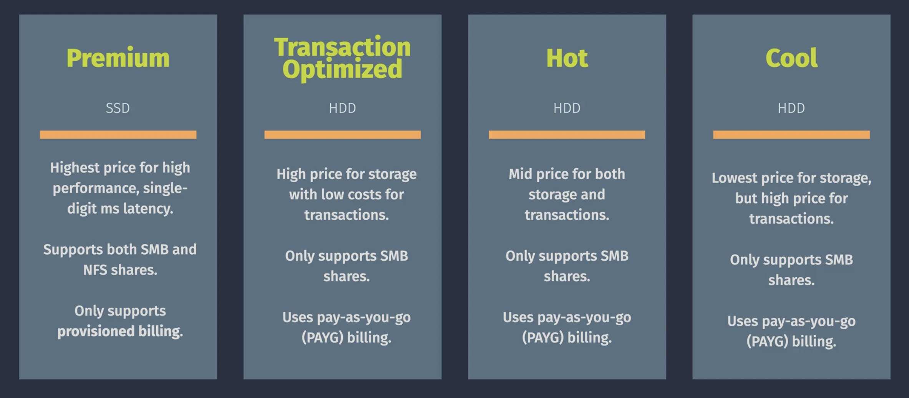
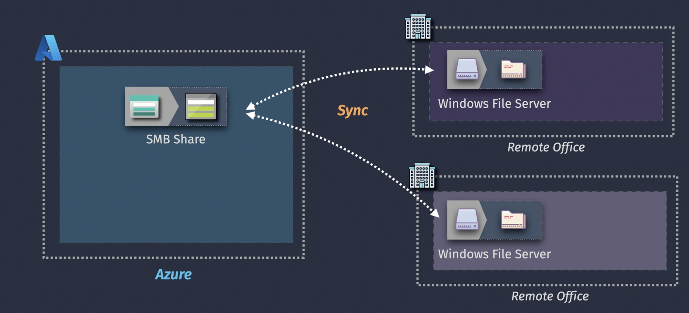
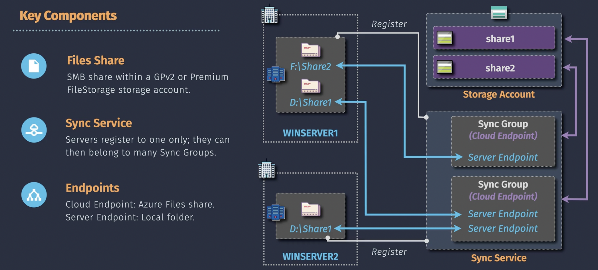

# Storage


When you want to use one of these storage service you first need to create a **storage account**

## Storage Account


## Storage Account Properties


The type of redundancy you can choose from depends on the selected performance (standrad, premium) and type (General Purpose, Block Blob, Page Blob, File)

- **LRS**: Local Redundant Storage
- **ZRS**: Zone Redundant Storage
- **GRS**: Geo Redundant Storage (failover to another region)
- **GZRS**: Geo Zone Redundant Storage

## Storage Account Types


## Blob Storage

- Blob Storage is built for web access
- Blob Storage containers does not have an hierarchy unless you select HNS (Hierarchy Name Space)
- Blob storage is the only storage type that provides public anonymous access
- Public access levels (at container level):
  - Private: no anonymous access
  - Blob: anonymous read access for blobs only (blob level)
  - Container: anonymous read access for containers and blobs) (container level)


### Blob Sub-Types

- **Blob Version**: automatically version blobs
- **Blob Snapshot**: Read-only point-in-time copy of a blob (only store differences (incremental))
- **Soft Deleted Blob**: Deleted blob that will be retained for a specified retention period

## How to control access to the data in Storage Account

3 options control HTTP (or HTTPS) access:

- Access Key bases access (storage account level)
- Entra ID based access (container level)
- SAS (Shared Access Signature) based access (data level)

Note: Blobs can also be accessed with NFS, and Files can also be accessed with SMB,NFS. When using these protocols there are other ways to control access.


## Access Key


## Entra ID Based Access


## SAS Based Access

### Service SAS

- Token that provides restricted access to a specific individual service (a blob, file, table, queue)
- Permissions for specific IP address or IP range
- Token Expiration
- Access from what protocol (HTTPS only, HTTPS and HTTP)
- CRUD permissions
- Service SAS is signed by Access Key. If the Access Key is rotated the Service SAS is revoked
- The SAS token is given to someone or something.
- A Service SAS is like a ticket given to a client, the server does not control access, access is in the ticket. If you do not like that then you can use **Stored Access Policy** to facilitate service-side control over Service SAS (see picture below)


### Account SAS

- Account SAS is similar to Service SAS but can provide access to multiple individual services instead of single individual service
- Account SAS is signed by Access Key. If the Access Key is rotated the Account SAS is revoked
- An Account SAS is like a ticket given to a client, the server does not control access, access is in the ticket. If you do not like that then you can use **Stored Access Policy** to facilitate service-side control over Account SAS

### User Delegation SAS

- More secure because User Delegated SAS is associated/created with an EntraID identity
- Only for Blob storage

## Azure Storage redundancy


### Local Redundant Storage (LRS)


### Zone Redundant Storage (ZRS)


### Geo Redundant Storage (GRS)


### Geo Zone Redundant Storage (GZRS)


**The data is always replicated (asynchronously) to the region pair**

### Secondary Read Access


There is also **RA-GZRS** next to **GZRS**

### Storage Account failover


## Blob Storage Access Tiers


- Data in Hot and Cold Tiers are online
- Data in Archive Tier is offline. You do not have access and need to **rehydrate** the data, meaning moving the data to Hot Tier or Cool Tier. This can take up to **15 hour** delay. This is all managed by Microsoft
- Hot and Coll access tiers can be set at account level
- Hot, Cold, Archive access tier can be set at individual blob
- Access Tier cannot be set at container level
- Access Tier is supported for Block Blobs, not for Append and Page Blobs


## Blob Storage Lifecycle Management

- Use Lifecycle Management Policies to automatically migrate a blob to another access tier or delete the blob
- Supported for Block Blobs and Append Blobs (only delete)


## Block Blob Object Replication

- Replicate Blob storage to another storage account in another region (other then rgion pair)
- Supported for Block Blobs
- Not Supported for Block Blobs in Archive mode


## Immutable Blob Storage

- Write Once Read Many (WORM)
- The Blob object is retained for some time (= retention period)
- When the Blob object is locked then the retention period cannot be changed
- When a Blob object must be investigated for some legal reasons, then **Legal Hold** can be switched on. The Blob object can be read but not modified or deleted.
- Immutable retention or Leak Hold can be set at container level or at storage account level.


## Azure Storage Encryption

Encrypt data:

- At rest: **Storage Service Encryption** or **Service Side Encryption** (SSE),**Infrastructure Encryption** (double encryption)
- In Transit: **SSL/TLS**

### SSE

- SSE is switched on by default at storage account
- By default only blobs and files are encrypted but when you create the storage account you can select to encrypt queues and tables too. This option cannot be changed after the creation of the storage account
- When you create a storage account you can select Infrastructure Encryption for extra encryption

Encryption Key:

- Platform Mananed Key (PMK)
- Customer Managed Key (CMK)
  - The CMK is stored in Azure Key Vault
  - You need a Managed Identity for storage account with the permission to access the CMK in Azure Key Vault
- Encryption Scope (Optional): Encrypt blobs/containers with PMK or CMK


## Azure Files

- SMB (Windows)
- NFS (Linux)

### Azure Files - Storage Tiers



### Azure Files - Architecture


### Azure Files - Connectivity and Access control


Identity Source can be:

- Active Directory Domain Controller you host on a Windows Server (on-premises host or Azure VM)
- Azure Active Directory Domain Services (Azure AD DS) (Microsoft Managed AD DS)
- Azure AD Kerberos (devices joined to an AD)

## Azure File Sync

- The files are stored on a SMB share and are synchronized with various remote on-premises Windows file servers
- Windows File Server only
- Azure File Sync Agent must be installed on the remore Windows File Server
- Azure File Sync Cloud Tiering is a feature of Azure File Sync that allows you to optimize storage on your on-premises servers by caching frequently accessed files locally while moving infrequently accessed files to the cloud. This is particularly useful for reducing the amount of storage consumed on local servers while still providing seamless access to all files. With Tiering policies you can configure how files are tiered based on availabe disk space (Space Policy), access frequency (Date Policy)
- Usually the SMB share of Azre File Sync is not directly accessed by users with SMB, but it is possible. But mind you that files created by these users are synced to the remote Windows File Servers within 24 hours





## Import/Export

### Azure Import/Export Service

The **Azure Import/Export Service** is a physical data transfer solution that allows you to securely transfer large amounts of data to or from Azure by shipping hard drives to an Azure datacenter. This service is especially useful for scenarios where transferring data over the internet is impractical due to bandwidth limitations, high costs, or time constraints.

---

### Key Features

1. **Offline Data Transfer**:

   - Use physical hard drives to transfer data, bypassing network constraints.

2. **High Capacity**:

   - Efficient for transferring large datasets, such as terabytes or petabytes.

3. **Secure**:

   - Data is encrypted using **BitLocker** and is handled securely during transit and processing.

4. **Supports Multiple Data Stores**:
   - Can be used to import data into or export data from **Azure Blob Storage** or **Azure Files**.

---

### Common Use Cases

1. **Data Migration to Azure**:

   - Transfer large datasets, such as backups, archives, or large media files, to Azure Blob Storage.

2. **Disaster Recovery**:

   - Retrieve critical data from Azure in case of outages or emergencies.

3. **Data Archiving**:

   - Move large volumes of archival data into Azure Storage.

4. **Analytics and Big Data**:
   - Transfer raw data for processing in Azure data services like Azure Data Lake or Azure Synapse Analytics.

---

### Workflow of Azure Import/Export

#### Import Workflow (On-Premises to Azure):

1. **Prepare Drives**:

   - Use the **Azure Import/Export tool** to prepare one or more BitLocker-encrypted drives.
   - The tool encrypts the drives and generates a journal file to track data.

2. **Create an Import Job**:

   - In the **Azure Portal**, create an Import Job specifying:
     - Destination storage account.
     - Number of drives to be shipped.

3. **Ship Drives**:

   - Package the drives securely and ship them to the Azure datacenter using the provided shipping instructions.

4. **Azure Processes the Drives**:

   - Once the drives arrive, Azure uploads the data to the specified storage account.

5. **Complete the Job**:
   - After data upload, Azure notifies you, and the drives are returned (if requested).

---

#### Export Workflow (Azure to On-Premises):

1. **Create an Export Job**:

   - In the **Azure Portal**, create an Export Job specifying:
     - Source storage account.
     - Data to be exported (e.g., blobs, files).
     - Return shipping details.

2. **Azure Prepares Drives**:

   - Azure copies the selected data to BitLocker-encrypted drives.

3. **Drives are Shipped**:

   - Azure ships the encrypted drives back to you.

4. **Unlock and Access Data**:
   - Use the Azure Import/Export tool to unlock the drives and access the exported data.

---

### Requirements and Considerations

1. **Supported Storage Types**:

   - Azure Blob Storage (block, page, and append blobs).
   - Azure Files (using SMB).

2. **Supported Drives**:

   - 2.5-inch or 3.5-inch SATA hard drives or SSDs.
   - Must be BitLocker-compatible.

3. **Encryption**:

   - All data must be encrypted with BitLocker for security during transit.

4. **Shipping**:

   - Use a shipping provider with tracking capabilities as specified by Azure.

5. **Region Support**:

   - Ensure the Azure region you are using supports the Import/Export service.

6. **Cost**:
   - Charges include per-drive processing fees and shipping costs. You are responsible for shipping costs to Azure; Azure covers return shipping.

---

### Advantages

1. **Time-Efficient**:

   - Avoid long transfer times for massive data sets over the internet.

2. **Secure Data Handling**:

   - Encryption ensures data security during transit.

3. **Reliable for Large Datasets**:
   - Transfers terabytes or petabytes effectively without impacting network performance.

---

### Limitations

1. **Physical Handling**:

   - Requires managing and shipping physical hard drives.

2. **Setup Complexity**:

   - Requires using the Azure Import/Export tool and carefully preparing the drives.

3. **Not Instantaneous**:
   - Includes time for shipping, processing, and returning drives.

---

### Tools for Azure Import/Export

1. **Azure Import/Export Tool**:

   - CLI tool for drive preparation and unlocking data.

2. **Azure Portal**:

   - Used to create and manage Import/Export jobs.

3. **Azure Storage Explorer**:
   - Optional tool for accessing data after it's uploaded.

---

### Summary

The **Azure Import/Export Service** is a practical solution for securely transferring large datasets to or from Azure using physical hard drives. It is ideal for scenarios where internet transfer is impractical due to bandwidth, cost, or time constraints. This service ensures data security with encryption and is especially useful for migration, disaster recovery, and big data projects.

## Data Box

- Azure Data Box is similare to Azure Import/Export, but instead of disks it uses an appliance (Data Box) to move data physically (not over the internet/network) between Azure and onpremises. Compared to Azure Import/Export, Azure Data Box is much easier to use.


## AzCopy

### What is Azure AzCopy?

**Azure AzCopy** is a command-line utility provided by Microsoft to **upload, download, and copy data** to and from Azure storage accounts quickly and efficiently. It supports various Azure storage types, including **Blob Storage**, **File Storage**, and **Table Storage**. AzCopy is optimized for high-performance data transfer and is available on Windows, Linux, and macOS.

---

### Key Features of AzCopy

1. **High-Speed Data Transfer**:

   - Optimized for fast and efficient data movement to and from Azure.

2. **Multi-Platform Support**:

   - Works on Windows, macOS, and Linux.

3. **Supports Different Azure Storage Services**:

   - **Blob Storage** (Block, Page, Append blobs).
   - **Azure Data Lake Storage (Gen1 and Gen2)**.
   - **File Storage** (SMB and NFS shares).
   - **Table Storage**.

4. **Parallelism**:

   - Uses multi-threading to maximize transfer speed.

5. **Resume and Retry**:

   - Automatically retries and resumes failed transfers.

6. **Secure Transfers**:

   - Supports SAS tokens, Azure Active Directory authentication, and HTTPS for secure transfers.

7. **Data Transfer Management**:
   - Offers options to copy only new or changed files.

---

### Common Use Cases

1. **Migrate Large Datasets**:

   - Upload terabytes or petabytes of data to Azure storage.

2. **Backup and Restore**:

   - Download or upload backups to and from Azure storage.

3. **Data Synchronization**:

   - Synchronize local and cloud storage by transferring only modified or new files.

4. **Cross-Region Data Transfers**:

   - Move data between Azure regions.

5. **Data Archival**:
   - Upload archival data to Azure Blob Storage for long-term storage.

---

### How to Use Azure AzCopy

#### 1. **Install AzCopy**

- Download and install AzCopy from [Microsoft's official site](https://learn.microsoft.com/en-us/azure/storage/common/storage-use-azcopy-v10).

#### 2. **Authenticate AzCopy**

- **Option 1: SAS Token**  
  Use a Shared Access Signature (SAS) to authenticate:
  ```bash
  azcopy copy "source_url_with_sas" "destination_url_with_sas"
  ```
- **Option 2: Azure AD Authentication**  
  Log in using Azure Active Directory:
  ```bash
  azcopy login
  ```

#### 3. **Transfer Files**

- **Upload Files to Blob Storage**:
  ```bash
  azcopy copy "/local/path/to/files/*" "https://<storageaccount>.blob.core.windows.net/<container>?<SAS>"
  ```
- **Download Files from Blob Storage**:
  ```bash
  azcopy copy "https://<storageaccount>.blob.core.windows.net/<container>/<file>?<SAS>" "/local/path"
  ```
- **Synchronize Directories**:
  ```bash
  azcopy sync "/local/path" "https://<storageaccount>.blob.core.windows.net/<container>?<SAS>"
  ```

#### 4. **Monitor Progress**

- AzCopy provides detailed progress reports in the terminal and can generate logs for auditing and troubleshooting.

---

### Supported Scenarios

#### **Azure Blob Storage**

- Upload/download blobs or containers.
- Supports Block, Page, and Append blobs.

#### **Azure Files**

- Transfer data to or from Azure File Shares.
- Supports SMB and NFS.

#### **Azure Data Lake Storage (Gen2)**

- Move data into hierarchical namespaces.

#### **Table Storage** (Limited Support)

- Export data to Table Storage.

---

### Key Options and Parameters

1. **Parallelism**:

   - Adjust the number of parallel operations to optimize speed:
     ```bash
     azcopy copy --parallelism <number>
     ```

2. **Overwrite Policy**:

   - Specify whether to overwrite existing files:
     ```bash
     azcopy copy --overwrite=prompt
     ```

3. **Include/Exclude Patterns**:

   - Transfer specific files:
     ```bash
     azcopy copy "/path/*.jpg" "https://<storageaccount>.blob.core.windows.net/<container>?<SAS>"
     ```

4. **Recursive Transfer**:

   - Copy directories and subdirectories:
     ```bash
     azcopy copy --recursive=true
     ```

5. **Dry Run**:
   - Simulate the operation without transferring files:
     ```bash
     azcopy copy --dry-run
     ```

---

### Benefits of AzCopy

1. **Efficiency**:
   - Handles large-scale data transfers with minimal setup.
2. **Flexibility**:
   - Supports various Azure storage services and authentication methods.
3. **Reliability**:
   - Automatically retries and resumes failed transfers.
4. **Cross-Platform**:
   - Works seamlessly on Windows, macOS, and Linux.

---

### Summary

Azure AzCopy is a powerful and versatile command-line tool designed to streamline data transfer to and from Azure storage services. It is highly optimized for speed, secure, and supports a wide range of scenarios, from simple file uploads to large-scale data migrations. Whether you're working with blobs, file shares, or data lake storage, AzCopy simplifies and accelerates the data transfer process.
