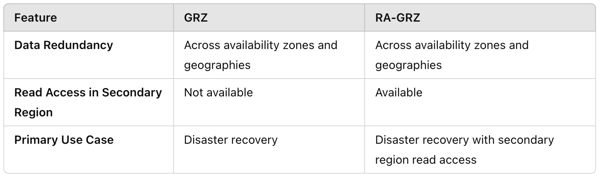

# Storage

When you want to use one of these storage service you first need to create a **storage account**

## Storage Account

## Storage Account Properties

The type of redundancy you can choose from depends on the selected performance (standrad, premium) and type (General Purpose, Block Blob, Page Blob, File)

- **LRS**: Local Redundant Storage
- **ZRS**: Zone Redundant Storage
- **GRS**: Geo Redundant Storage (failover to another region)
- **GZRS**: Geo Zone Redundant Storage

## Storage Account Types

## Blob Storage

- Blob Storage is built for web access
- Blob Storage containers does not have an hierarchy unless you select HNS (Hierarchy Name Space)
- Blob storage is the only storage type that provides public anonymous access
- Public access levels (at container level):
  - Private: no anonymous access
  - Blob: anonymous read access for blobs only (blob level)
  - Container: anonymous read access for containers and blobs) (container level)

### Blob Sub-Types

- **Blob Version**: automatically version blobs
- **Blob Snapshot**: Read-only point-in-time copy of a blob (only store differences (incremental))
- **Soft Deleted Blob**: Deleted blob that will be retained for a specified retention period

## How to control access to the data in Storage Account

3 options control HTTP (or HTTPS) access:

- Access Key bases access (storage account level)
- Entra ID based access (container level)
- SAS (Shared Access Signature) based access (data level)

Note: Blobs can also be accessed with NFS, and Files can also be accessed with SMB,NFS. When using these protocols there are other ways to control access.

## Access Key

## Entra ID Based Access

## SAS Based Access

### Service SAS

- Token that provides restricted access to a specific individual service (a blob, file, table, queue)
- Permissions for specific IP address or IP range
- Token Expiration
- Access from what protocol (HTTPS only, HTTPS and HTTP)
- CRUD permissions
- Service SAS is signed by Access Key. If the Access Key is rotated the Service SAS is revoked
- The SAS token is given to someone or something.
- A Service SAS is like a ticket given to a client, the server does not control access, access is in the ticket. If you do not like that then you can use **Stored Access Policy** to facilitate service-side control over Service SAS (see picture below)

### Account SAS

- Account SAS is similar to Service SAS but can provide access to multiple individual services instead of single individual service
- Account SAS is signed by Access Key. If the Access Key is rotated the Account SAS is revoked
- An Account SAS is like a ticket given to a client, the server does not control access, access is in the ticket. If you do not like that then you can use **Stored Access Policy** to facilitate service-side control over Account SAS

### User Delegation SAS

- More secure because User Delegated SAS is associated/created with an EntraID identity
- Only for Blob storage

## Azure Storage redundancy

### Local Redundant Storage (LRS)

### Zone Redundant Storage (ZRS)

### Geo Redundant Storage (GRS)

### Geo Zone Redundant Storage (GZRS)

**The data is always replicated (asynchronously) to the region pair**

### Secondary Read Access

There is also **RA-GZRS** next to **GZRS**

### Storage Account failover

## Blob Storage Access Tiers

- Data in Hot and Cold Tiers are online
- Data in Archive Tier is offline. You do not have access and need to **rehydrate** the data, meaning moving the data to Hot Tier or Cool Tier. This can take up to **15 hour** delay. This is all managed by Microsoft
- Hot and Coll access tiers can be set at account level
- Hot, Cold, Archive access tier can be set at individual blob
- Access Tier cannot be set at container level
- Access Tier is supported for Block Blobs, not for Append and Page Blobs

## Blob Storage Lifecycle Management

- Use Lifecycle Management Policies to automatically migrate a blob to another access tier or delete the blob
- Supported for Block Blobs and Append Blobs (only delete)

## Block Blob Object Replication

- Replicate Blob storage to another storage account in another region (other then rgion pair)
- Supported for Block Blobs
- Not Supported for Block Blobs in Archive mode

## Immutable Blob Storage

- Write Once Read Many (WORM)
- The Blob object is retained for some time (= retention period)
- When the Blob object is locked then the retention period cannot be changed
- When a Blob object must be investigated for some legal reasons, then **Legal Hold** can be switched on. The Blob object can be read but not modified or deleted.
- Immutable retention or Leak Hold can be set at container level or at storage account level.

## Azure Storage Encryption

Encrypt data:

- At rest: **Storage Service Encryption** or **Service Side Encryption** (SSE),**Infrastructure Encryption** (double encryption)
- In Transit: **SSL/TLS**

### SSE

- SSE is switched on by default at storage account
- By default only blobs and files are encrypted but when you create the storage account you can select to encrypt queues and tables too. This option cannot be changed after the creation of the storage account
- When you create a storage account you can select Infrastructure Encryption for extra encryption

Encryption Key:

- Platform Mananed Key (PMK)
- Customer Managed Key (CMK)
  - The CMK is stored in Azure Key Vault
  - You need a Managed Identity for storage account with the permission to access the CMK in Azure Key Vault
- Encryption Scope (Optional): Encrypt blobs/containers with PMK or CMK

## Azure Files

- SMB (Windows)
- NFS (Linux)

### Azure Files - Storage Tiers

### Azure Files - Architecture

### Azure Files - Connectivity and Access control

Identity Source can be:

- Active Directory Domain Controller you host on a Windows Server (on-premises host or Azure VM)
- Azure Active Directory Domain Services (Azure AD DS) (Microsoft Managed AD DS)
- Azure AD Kerberos (devices joined to an AD)
