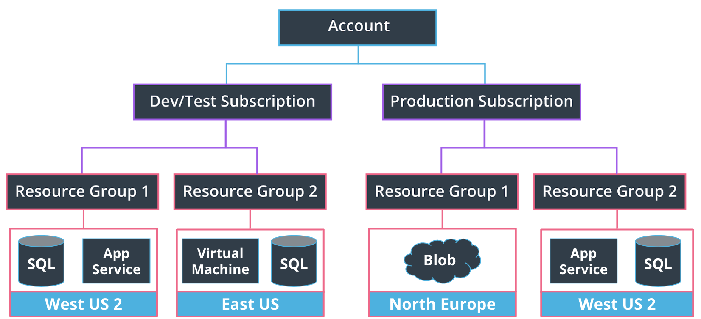

# Azure Resource Hierarchy

Azure uses a hierarchical system to keep resources organized and to manage expenses easily.

This starts at the top with your Azure Account. The next level down is the Subscription level; in this course, you will likely only work with one subscription, but it's likely in your day-to-day Azure work that you may be working with more than one. For instance, there may be one subscription for development and testing and another for production systems.

Below the subscription level is where you'll find Resource Groups. These help to organize resources you use, such as Virtual Machines and App Services (as well as storage options and other resources we'll discuss in later lessons), to make resource management easier. You may have a resource group for a specific project, or because resource groups are tied to a Region, you may have resource groups containing similar resources in multiple locations across the world. A region contains at least one data center, but could have multiple data centers that are close by and networked together through a low-latency network. There are over 60 regions available worldwide and available in 140 countries, such as East US and Japan West.

When choosing a region, it's important to consider what you are trying to achieve. For development and testing purposes, you likely want a region close to yourself; for production purposes, you often want resources to be close to your user. Keep the following in mind:

- Service availability - Some services may not be available in a particular region.
- Performance - Latency determines network service performance; are you creating resources for yourself or your end-user?
- Cost - Costs of services vary by region. If latency isn’t an issue, you might want to deploy your services in the cheapest region.

# Subscription

- When you create a new Azure subscription you do not create a new account.
- Each Azure subscription is associated with a billing account.
- A billing account is a billing profile that contains all billing information.
- Each Azure subscription is associated with one Entra ID tenant for Identity and Access Management (IAM).
- You can set Azure policies at a subscription.
- A subscription can be member of one management group.
- Set up a budget for each subscription to prevent unexpected high costs
- The user that creates the subscription is the subscription owner and has full access to the subscription.

## Subscription license models

- Free (duration = 12 months, get free credits to be consumed within 30 days)
- Student (duration = 12 months, get free credits to be consumed within 12 months)
- Pay as you Go (contains free tier: free services with specific configurations and limits)

## Technical support models

- Basic (billing and subscription management support but no technical support) Free!
- Developer
- Standard
- Professional Direct
