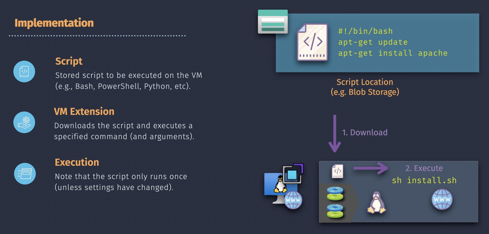

# Virtual Machines

## Overview

- Cannot change VM name
- Cannot change VNET
- VM can be resized (scale-up, scale-down)
- You can select whether the OS disk, public IP, NIC should be or should not be deleted when the VM is deleted.


## VM Cost Models

### Pay-as-you-go

When the VM is shutdown and deallocated, then

- No cost for the VM, however you are still paying for associated resources such as storage and public IP.
- VM still counts to the subscription resource limits

## VM Family

- General Purpose
- Compute Optimized
- Memory Optimized
- Storage Optimized
- High Performance Compute
- GPU

## Disk Storage


### Disk types

**OS Disk**

- Can use Image from the Marketplace, uploaded VHDs, or Custom Images
- Can be resized but this requires downtime (stop/deallocate VM)
- OS disks cannot be added/detached but can be swapped
- By default OS disk is deleted when VM is deleted but you can change this setting

**Data Disks**

- For some VM types (or SKUs) you can resize the data disk withoy downtime
- You can add/detach data disks without downtime (but you should stop activity). You can detach a data disk from one VM and attach it to another VM but make sure that when you detach the data disk no application is writing to the data disk.
- When you have added a new data disk to a VM, you need to partition the disk, format the partition and mount the partition in the filesystem.

**Temporary Disk**

- Directly attached storage to the host/hypervisor.
- Mounted by default for Windows as `D` drive
- Mounted by default for Linux as `dev/sdb1`
- ephemeral storage, data is lost when the VM has restarted
- Not all VM types (or SKUs) come with a temp disk. The size of temp disk depends on type of VM

### Disk Performance

- throughput
- IOPS


### Snapshot

- Full Snapshot
- Incremental Snapshot

## VM Networking


- One VM can have multiple NIC's in different Subnets but in the same VNET
- When you attach a new NIC to a VM, the VM must be stopped first.
- One NIC can have multiple IP's (ipconfig)
- You can change IP addresses and Subnets associated with a NIC
- You cannot change the VNET associated with a NIC
- IPv6 addresses are supported but must have been enabled for the associated VNET/Subnet
- A NIC might be associated with a public IP, which is a separate resource outside managed by Microsoft. When someone from the internet access this public IP, Microsoft make sure it is routed to the VM/NIC.

## VM Image


- When the VM has been generalized (or specialized) and the VMS has been stopped and deallocated then the image can be captured
- When a VM has been generalized it cannot be used anymore
- When capturing an image in an Image Gallery there are additional features like versioning, replication accross different regions
- images in the Image Gallery are not Market Place images

## VM Configuration Management


### Custom Script Extensions



Yes, you can add a new **custom script extension** to a running Azure VM. The **Custom Script Extension** is used to run scripts on an Azure VM during or after its deployment. This is especially useful for configuration tasks, software installation, or other custom actions.

---

#### How to Add a Custom Script Extension to a Running Azure VM

##### 1. **Using the Azure Portal**

- Go to the Azure portal and navigate to the VM you want to modify.
- In the left-hand menu, select **Extensions + applications**.
- Click **+ Add** to add a new extension.
- Choose **Custom Script Extension** from the list.
- Upload your script file or provide a URL pointing to the script.
- Specify any required arguments for the script.
- Click **OK** to apply the extension. Azure will execute the script on the VM.

##### 2. **Using Azure CLI**

You can use the Azure CLI to add a custom script extension:

```bash
az vm extension set \
  --resource-group <ResourceGroupName> \
  --vm-name <VMName> \
  --name CustomScript \
  --publisher Microsoft.Azure.Extensions \
  --settings '{"fileUris":["<ScriptFileURL>"],"commandToExecute":"<Command>"}'
```

- Replace `<ResourceGroupName>` and `<VMName>` with your VM's details.
- Replace `<ScriptFileURL>` with the URL of your script (stored in an accessible location like Azure Blob Storage).
- Replace `<Command>` with the script execution command (e.g., `bash script.sh` or `powershell -File script.ps1`).

##### 3. **Using Azure PowerShell**

You can use Azure PowerShell to achieve the same:

```powershell
Set-AzVMCustomScriptExtension -ResourceGroupName <ResourceGroupName> `
  -VMName <VMName> `
  -Location <Location> `
  -FileUri "<ScriptFileURL>" `
  -Run "<Command>"
```

- Replace placeholders as appropriate.

---

#### Key Considerations

- **Script Location**:

  - Scripts must be accessible (e.g., via Azure Blob Storage, GitHub, or other public URLs).
  - Secure sensitive scripts or credentials appropriately (use SAS tokens for Blob Storage or Azure Key Vault).

- **Idempotency**:

  - Ensure your script is idempotent, meaning it won't fail or cause issues if run multiple times.

- **Logging**:

  - Logs for the script execution are stored in the VM's `C:\WindowsAzure\Logs\Plugins` (Windows) or `/var/log/azure` (Linux) directories.

- **Extension Overwriting**:
  - If a Custom Script Extension is already installed, adding another script overwrites the previous settings. You can re-run or update the extension with new scripts.

---

By using the Custom Script Extension, you can dynamically update and configure running Azure VMs without needing to redeploy or restart them.

### Cloud-init

**Cloud-Init** is an open-source, industry-standard tool used to **configure and customize virtual machines (VMs) in the cloud** at first boot. It is widely supported across major cloud platforms, such as Azure, AWS, Google Cloud, and OpenStack. It automates tasks like configuring network settings, injecting SSH keys, running scripts, and installing packages, making it a critical tool for cloud automation.

---

#### Key Features of Cloud-Init

1. **User Data Handling**:

   - Accepts user-provided data (e.g., YAML configuration, shell scripts) at VM creation time and executes it during the VM's first boot.

2. **Multi-Cloud Support**:

   - Works across various cloud platforms, ensuring consistent VM initialization in multi-cloud environments.

3. **Flexible Configuration**:

   - Configures various VM aspects, such as:
     - **Networking**: Setting up IP addresses, DNS, and routes.
     - **User Accounts**: Creating users, setting passwords, and injecting SSH keys.
     - **Package Installation**: Installing software or updating packages.
     - **Custom Scripts**: Running bash, Python, or other scripts.

4. **Modular Design**:
   - Uses modules for different tasks (e.g., `cc_mounts` for mounting volumes, `cc_ssh` for SSH configuration), allowing extensive customization and modular functionality.

---

#### How Cloud-Init Works

1. **Image Creation**:

   - Cloud-Init is baked into the cloud image (pre-installed by cloud providers or in custom images).

2. **Boot Time**:

   - When the VM is launched, Cloud-Init reads metadata provided by the cloud platform and processes user-supplied data.

3. **Configuration Execution**:

   - Based on the provided data, Cloud-Init performs tasks such as creating users, configuring networking, or running scripts.

4. **Lifecycle**:
   - Cloud-Init typically runs during the **first boot** and configures the VM. After this, its state is stored to prevent re-running unless explicitly reset.

---

#### Common Use Cases

1. **Automated Provisioning**:

   - Automate the setup of VMs with pre-defined configurations for scaling or repetitive tasks.

2. **SSH Key Injection**:

   - Automatically inject SSH keys into the VM for secure, password-less login.

3. **Software Installation**:

   - Install necessary packages or services (e.g., web servers, databases) at the time of VM creation.

4. **Custom Initialization Scripts**:
   - Execute user-defined scripts to set up specific configurations or applications.

---

#### Example User Data for Cloud-Init

A YAML file used as user data might look like this:

```yaml
#cloud-config
users:
  - name: newuser
    groups: sudo
    shell: /bin/bash
    ssh-authorized-keys:
      - ssh-rsa AAAAB3Nza... user@example.com

package_update: true
package_upgrade: true
packages:
  - nginx
  - git

runcmd:
  - echo "Hello, Cloud-Init!" > /var/www/html/index.html
  - systemctl restart nginx
```

This configuration:

- Creates a new user with SSH access.
- Updates and installs packages (e.g., Nginx and Git).
- Sets up a welcome page for Nginx.

---

#### Why Use Cloud-Init?

Cloud-Init simplifies the VM provisioning process, enabling rapid, consistent, and automated setup of infrastructure in cloud environments. It reduces manual intervention and ensures consistent configurations across environments.

### Automated State Configuration

**Azure Automation State Configuration** is a cloud-based configuration management service in Azure that allows you to ensure your servers' configurations meet desired states by leveraging **PowerShell Desired State Configuration (DSC)**. It enables you to define, enforce, and monitor configurations for both Windows and Linux servers, whether they are in Azure, on-premises, or in other clouds.


#### Key Features of Azure Automation State Configuration

1. **Desired State Management**:

   - Automatically ensures that servers are configured to meet a predefined desired state, including software, settings, and roles.

2. **Drift Detection and Reporting**:

   - Detects configuration drift (when the server's current state deviates from the desired state) and provides detailed reporting.

3. **Cross-Platform Support**:

   - Works with both Windows and Linux servers.

4. **Integration with Azure Automation**:

   - Part of the Azure Automation suite, which also includes process automation and update management.

5. **Pull Configuration Model**:

   - Servers can pull configurations from a centralized Azure State Configuration endpoint.

6. **Role-Based Access Control (RBAC)**:
   - Use Azure's RBAC to control access to configuration definitions and management.

---

#### How Azure Automation State Configuration Works

1. **Create a Azure Automation Account**:

2. **Create a DSC Configuration**:

   - Define the desired state of a server using a PowerShell DSC script. A configuration script specifies the settings and resources to be applied.

   Example DSC Configuration Script:

   ```powershell
   Configuration WebServer
   {
       Node "MyServer"
       {
           WindowsFeature IIS
           {
               Ensure = "Present"
               Name   = "Web-Server"
           }
       }
   }
   ```

3. **Compile the Configuration**

4. **Assign the Target Servers**

5. **Apply Configuration**:

   - The target servers periodically check with the Azure Automation DSC pull server and apply the desired state if needed. The target servers will have `DSC` extenstion.

6. **Monitor Compliance**:
   - Azure Automation State Configuration provides compliance reports to show whether each server is aligned with its assigned configuration.

---

#### Benefits of Azure Automation State Configuration

1. **Consistency**:

   - Ensures that all managed servers maintain a consistent configuration.

2. **Ease of Management**:

   - Centralized management through the Azure portal for all configurations, reducing manual overhead.

3. **Scalability**:

   - Suitable for managing configurations across a large number of servers in multiple environments.

4. **Drift Correction**:

   - Automatically corrects configuration drift by reapplying the desired state when necessary.

5. **Cross-Environment Support**:
   - Works across Azure, hybrid environments, and multi-cloud scenarios.

---

#### Use Cases for Azure Automation State Configuration

1. **Server Configuration Management**:

   - Automate and enforce configurations for servers running specific software, services, or roles.

2. **Compliance and Security**:

   - Maintain compliance with regulatory or organizational standards by enforcing configurations.

3. **Application Deployment**:

   - Configure and prepare servers to host specific applications.

4. **Hybrid Cloud Management**:
   - Manage and monitor configurations for servers in on-premises data centers or other cloud environments.

---

#### Integration with Azure Features

- **Update Management**:
  - Combine with update management to ensure configurations are enforced after updates.
- **Azure Policy**:
  - Use Azure Policy to audit the compliance of your servers' configurations.

Azure Automation State Configuration simplifies and automates the process of managing consistent configurations across your infrastructure, reducing the risk of misconfigurations and improving operational efficiency.

### IMDS

**Azure Instance Metadata Service (IMDS)** is a secure REST endpoint provided by Azure that allows Azure Virtual Machines (VMs) and other compute resources to retrieve information about themselves and their environment. IMDS is especially useful for applications running on Azure VMs to programmatically access metadata such as the VM's configuration, location, and assigned identity.

---

#### Key Features of Azure IMDS

1. **Secure and Local**:

   - IMDS is accessible only from within the VM itself and does not require external network access, enhancing security.

2. **Metadata Access**:

   - Provides information about the VM, such as its region, size, IP address, resource ID, tags, and more.

3. **Identity Access**:

   - Supports **Managed Identity** to retrieve tokens for accessing Azure resources without needing credentials.

4. **Dynamic Updates**:

   - Metadata is dynamically updated to reflect the current state of the VM.

5. **REST-Based**:
   - Accessible via HTTP at the local endpoint `http://169.254.169.254/metadata/instance`.

---

#### Common Use Cases of IMDS

1. **Configuration Awareness**:

   - Applications can dynamically adapt based on VM information, such as location, size, or tags.

2. **Resource Management**:

   - Use metadata to monitor and manage resources programmatically.

3. **Identity-Based Authentication**:

   - Retrieve tokens for a VM’s **Managed Identity** to securely access Azure services (e.g., Azure Key Vault, Blob Storage) without using stored credentials.

4. **Environment Validation**:

   - Verify the VM’s configuration (e.g., size, region, or subscription) at runtime.

5. **Tag-Based Automation**:
   - Retrieve VM tags for automation workflows.

---

#### Example: Querying IMDS

##### 1. Accessing Metadata

To query IMDS, use `curl` with the required metadata header:

```bash
curl -H "Metadata:true" "http://169.254.169.254/metadata/instance?api-version=2021-02-01"
```

This returns JSON-formatted metadata about the VM.

##### 2. Example Response (Partial)

```json
{
  "compute": {
    "location": "eastus",
    "name": "myVM",
    "offer": "UbuntuServer",
    "osType": "Linux",
    "platformFaultDomain": "0",
    "platformUpdateDomain": "0",
    "resourceGroupName": "myResourceGroup",
    "subscriptionId": "12345678-1234-1234-1234-123456789abc",
    "vmId": "abcd1234-abcd-1234-abcd-1234abcd5678",
    "vmSize": "Standard_DS1_v2"
  },
  "network": {
    "interface": [
      {
        "ipv4": {
          "ipAddress": [
            {
              "privateIpAddress": "10.0.0.4",
              "publicIpAddress": "52.176.12.34"
            }
          ]
        }
      }
    ]
  }
}
```

---

#### Metadata Categories Available

1. **Compute Metadata**:

   - Information about the VM's size, region, resource group, fault domain, update domain, etc.

2. **Network Metadata**:

   - Details about the network interfaces, IP addresses, and virtual network.

3. **Identity Metadata**:

   - Tokens for the VM's **Managed Identity**, enabling secure access to Azure services.

4. **Security Metadata**:
   - Information related to security policies and configurations.

---

#### Benefits of IMDS

- **Secure Access**: Limited to the VM's internal environment.
- **Dynamic and Real-Time**: Always up-to-date with the latest VM configuration.
- **Simplified Identity Management**: Integrated with Azure Managed Identities for secure, passwordless authentication.
- **Multi-Purpose**: Useful for resource discovery, monitoring, and automation.

## Virtual Machine Scale Set (VMSS)

Azure Virtual Machine Scale Sets (VMSS) are a service that enables you to deploy and manage a group of identical, load-balanced virtual machines (VMs). They are designed for scenarios where you need to automatically scale your application to handle variable workloads efficiently.

### VMSS - Uniform Orchestration

The VMs in a Uniform VMSS are not independent resources and cannot be managed separately


### VMSS - Flexible Orchestration

The VMs that have been attached to a Flexible VMSS are independant resources and can be managed separately.


### VMSS - Autoscaling Rules


### VMSS - examples

```
az vmss create \
  --resource-group myResourceGroup \
  --name myScaleSet \
  --image UbuntuLTS \
  --upgrade-policy-mode automatic \
  --admin-username azureuser \
  --generate-ssh-keys \
  --instance-count 2
```

```
az monitor autoscale rule create \
  --resource-group myResourceGroup \
  --autoscale-name myScaleSetAutoscale \
  --condition "Percentage CPU > 70" \
  --scale out 2
```

### VMSS Health and Repair

Azure Virtual Machine Scale Sets (VMSS) Health and Repair is a feature that ensures the instances in a scale set remain healthy and operational. It monitors the health of VMs within the scale set and automatically repairs or replaces unhealthy instances to maintain the desired state and application availability.

## Availability Set

An Azure Availability Set is a logical grouping of Virtual Machines (VMs) within a datacenter designed to provide redundancy and availability. It ensures that your application remains operational during planned maintenance events or unexpected hardware failures.


- **Fault Domain (FD)**: A fault domain is a group of hardware (e.g., servers, network switches) that share a common power source and network connection. Default is 3 FDs.
- **Update Domain (UD)**: An update domain ensures that not all VMs are updated simultaneously during planned maintenance (e.g., patching or OS updates). Default is 5 UDs.
- **Redundancy and High Availability**: Distributes VMs across multiple FDs and UDs to reduce the likelihood of simultaneous failures.
- **No Extra Cost**: Using availability sets does not incur additional costs; you only pay for the VMs and associated resources.
- First create an Availabilty Set, then add a VM. An existing VM cannot be added to a new Availability Set
- When you add a VM to an Avilability Set it has to match the resource group and region as well.
- Virtual Machine Scale Sets (VMSS) have an implicit Availability Set

### Create an Availability Set

```
az vm availability-set create \
  --resource-group myResourceGroup \
  --name myAvailabilitySet \
  --platform-fault-domain-count 3 \
  --platform-update-domain-count 5
```

### Add an VM to an Availability Set

```
az vm create \
  --resource-group myResourceGroup \
  --name myVM1 \
  --availability-set myAvailabilitySet \
  --image UbuntuLTS \
  --admin-username azureuser \
  --generate-ssh-keys
```

## Availability Zone

An Azure Availability Zone is a high-availability offering within an Azure region that provides fault isolation by dividing the region into physically separate and independent zones. Each zone is a unique physical location within a region, with its own power, cooling, and networking infrastructure.

## Proximity Placement Group


## VM Encryption with Azure Disk Encryption


